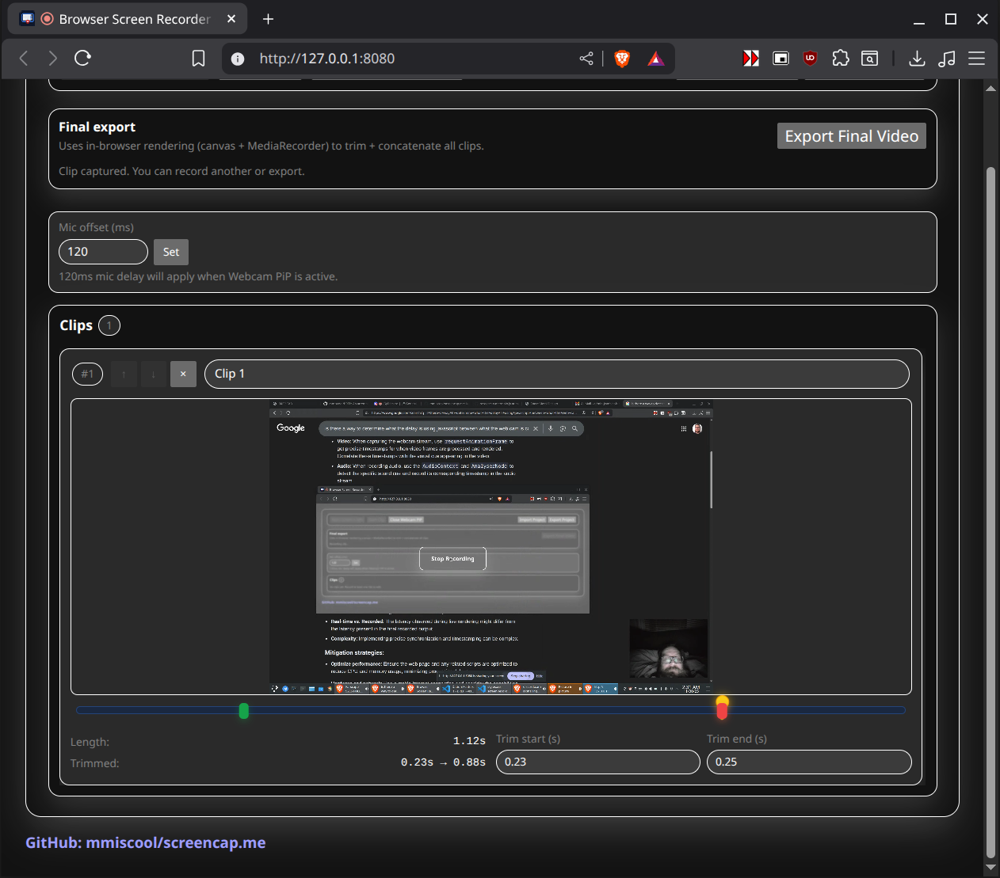

# screencap.me — Screen Recorder + Editor

This repo is configured for the `screencap.me` CNAME and ships a no-nonsense browser app for grabbing your screen + microphone, optionally floating your webcam in Picture-in-Picture, chopping clips, and exporting one stitched video without touching FFmpeg or a backend.

## Why use it
- Start capturing screen + mic instantly; every stop creates a new clip
- Trim start/end points per clip and reorder the timeline
- Optional Webcam PiP so you can float your face cam while recording the screen
- Export the final video fully in-browser (canvas + MediaRecorder) as webm
- Save/load projects as a single JSON file (clips are embedded as base64)
- Zero installs or builds—just open `index.html` on `localhost`

## Quick start
1) Run a simple local server in the repo (screen capture needs a secure context):  
   `python -m http.server 8000` then open http://localhost:8000  
2) Click **Start Screen + Mic** and grant capture permissions.  
3) Click **Start Clip** to begin recording; hit the full-screen **Stop Recording** overlay to finish. Repeat to collect more clips.  
4) If you want your camera visible, hit **Webcam PiP** to open it in a floating PiP window (no recording, just live view).  
5) Trim each clip (start/end seconds), reorder with ↑/↓, then **Export Final Video**.  
6) Download the generated webm when the status reads “Done.”  

## Editing and workflow
- Every recording stop adds a clip to the left panel; durations load automatically.
- Use trim fields or drag handles to set start/end; playheads update live while scrubbing.
- Reorder clips with the arrow buttons; delete with ×.
- Export uses an in-browser render path (canvas + MediaRecorder) so no uploads or external encoders are involved.

## Project files
- **Export Project** writes a JSON that embeds all clips as data URLs (base64).  
- **Import Project** reloads that JSON and restores clips, trims, and order.  
- Downloads stay in your browser—no server round-trips.

## Notes
- Works in modern Chromium-based browsers; screen capture may require selecting a tab/window and enabling audio.
- Everything stays local; close the tab or refresh to clear captures unless you export the project or final video.
